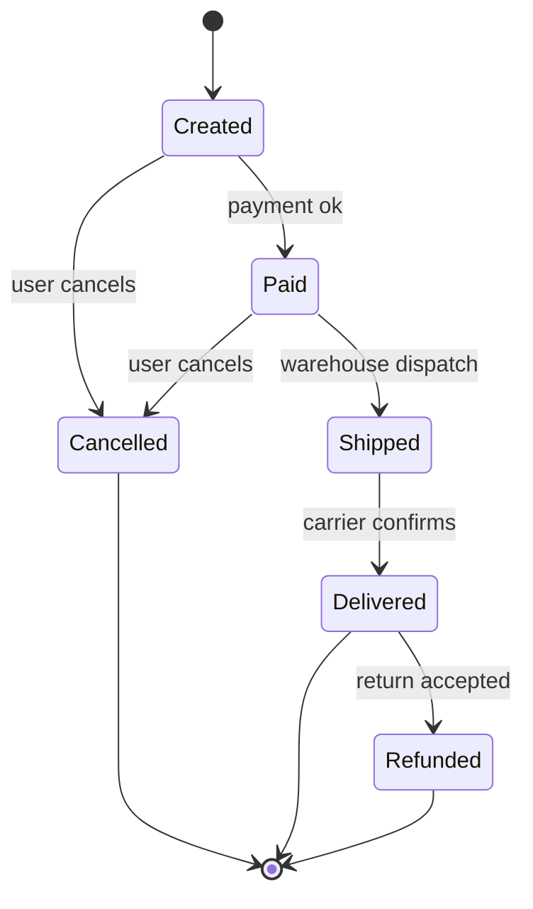

# What states can an order be in?

An order moves forward from created to delivered; it can be cancelled until it ships,
and refunded after delivery.

```mermaid
stateDiagram-v2
  [*] --> Created
  Created --> Paid: payment ok
  Created --> Cancelled: user cancels
  Paid --> Shipped: warehouse dispatch
  Paid --> Cancelled: user cancels
  Shipped --> Delivered: carrier confirms
  Delivered --> Refunded: return accepted
  Cancelled --> [*]
  Delivered --> [*]
  Refunded --> [*]
```
